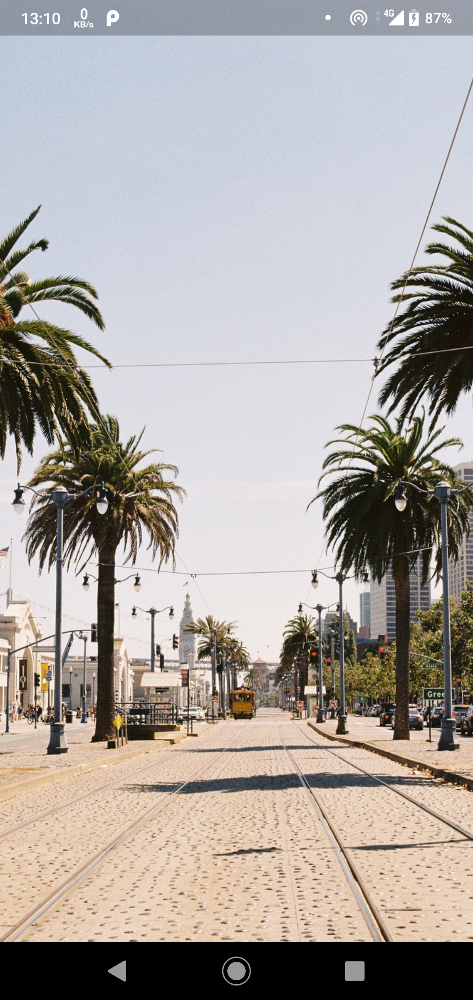

# Random Image

This project was built as part of a Flutter hackathon following the workshop by [Parth Jansari](https://github.com/parth181195) in [IIITV](https://github.com/iiitv).

## What it does

Originally this app was supposed to parse JSON and use [unsplash api](https://unsplash.com/developers) but since I was not able to build this app at that time, I figured my own way out and used [Unsplash Source](https://source.unsplash.com/) to build this application and changed the URL with every setState build to provide a different image everytime the user taps on the screen.

## ScreenShot

